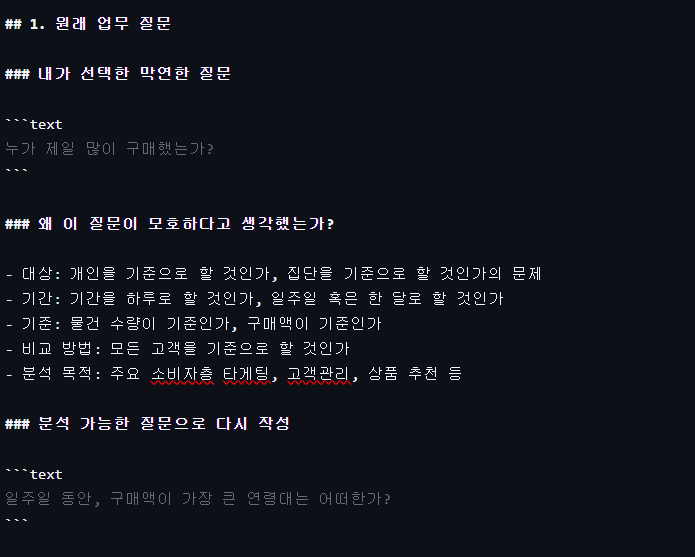
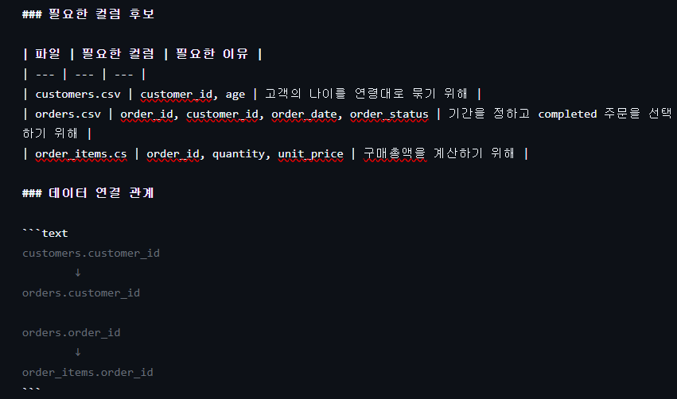
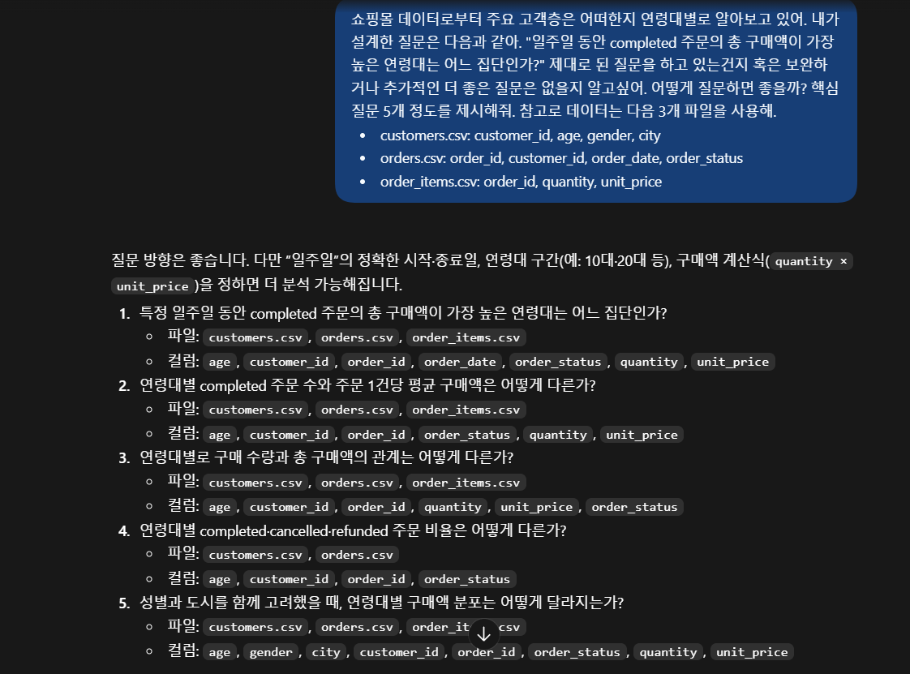
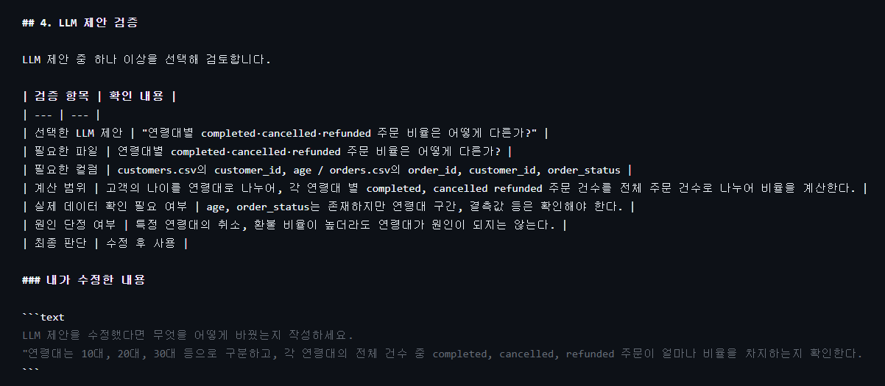
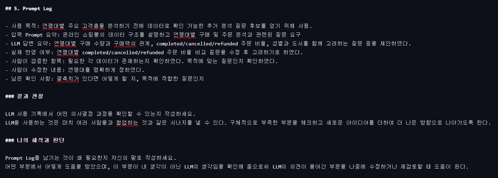
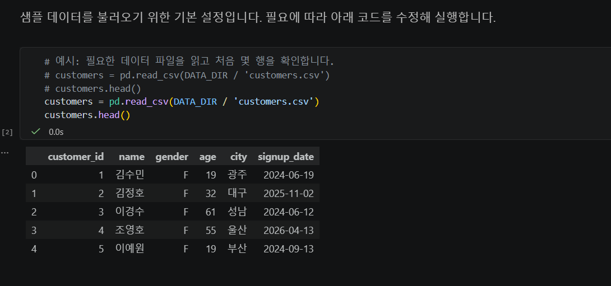

# Chapter 01 제출 답안. AI와 함께하는 데이터 분석의 시작

> 이 파일은 Chapter 01 실습 결과를 정리하여 제출하기 위한 학생용 템플릿입니다.  
> 강사 저장소의 원본 템플릿을 직접 수정하지 말고, 자신의 PC에 복사한 뒤 작성합니다.

---

## 0. 제출 정보

- 이름: 위현준
- GitHub ID: WIE-HYUNJUN
- 개인 저장소명: `llm-data-analysis-study`
- 작성일: 2026/9/9
- 사용한 LLM: ChatGPT

### 최종 제출 URL

```text
여기에 개인 GitHub 저장소의 chapter01/chapter01.md 파일 URL을 입력하세요.
```
https://github.com/WIE-HYUNJUN/llm-data-analysis-study/blob/main/chapter01/chapter01.md
---

## 1. 원래 업무 질문

### 내가 선택한 막연한 질문

```text
누가 제일 많이 구매했는가?
```

### 왜 이 질문이 모호하다고 생각했는가?

- 대상: 개인을 기준으로 할 것인가, 집단을 기준으로 할 것인가의 문제
- 기간: 기간을 하루로 할 것인가, 일주일 혹은 한 달로 할 것인가
- 기준: 물건 수량이 기준인가, 구매액이 기준인가
- 비교 방법: 모든 고객을 기준으로 할 것인가
- 분석 목적: 주요 소비자층 타게팅, 고객관리, 상품 추천 등 

### 분석 가능한 질문으로 다시 작성

```text
일주일 동안, 구매액이 가장 큰 연령대는 어떠한가?
```

### 결과 관찰

대상을 집단(연령대)으로 확정하고 기간을 일주일로 정하였다. 수량이 아닌 구매액을 기준으로 하며 모든 집단의 구매총액을 비교할 것이다.

### 나의 해석과 판단

일단 사람은 물론이고 LLM이 이해하기에도 모호한 영역이 사라졌다. 정확히 구분할 수 있는 기준을 정하였기 때문에 이후 과정이 훨씬 수월할 것 같다.

### 업무·분석적 의미

이 질문은 업체의 주요 고객층의 연령대가 어떠한지를 파악할 수 있게 해준다. 이를 바탕으로 주요 고객에 대한 마게팅을 극대화하거나 구매력이 약한 소비자군 연령대를 찾아 이를 보완할 수 있는 바탕이 된다.
### 한계와 추가 확인 사항

현재 질문에서는 목적이 명확하지 않고, 연령대를 구체적으로 어떻게 나눌 것인지 명확하게 제시되지 않았다.

### Evidence



---

## 2. 질문과 필요한 데이터 연결

### 필요한 데이터 파일

- [v] `customers.csv`
- [ ] `products.csv`
- [v] `orders.csv`
- [v] `order_items.csv`

### 필요한 컬럼 후보

| 파일 | 필요한 컬럼 | 필요한 이유 |
| --- | --- | --- |
| customers.csv | customer_id, age | 고객의 나이를 연령대로 묶기 위해 |
| orders.csv | order_id, customer_id, order_date, order_status | 기간을 정하고 completed 주문을 선택하기 위해 |
| order_items.cs | order_id, quantity, unit_price | 구매총액을 계산하기 위해 |

### 데이터 연결 관계

```text
customers.customer_id
        ↓
orders.customer_id

orders.order_id
        ↓
order_items.order_id
```

### 결과 관찰

customers.csv에 age가 있고, 파일들을 연결하여 연령대별 총 구매액을 계산할 수 있다.
### 나의 해석과 판단

데이터로 충분히 답할 수 있지만 연령대를 정해야 한다.

### 업무·분석적 의미

무엇이 왜 필요한지 알고 있음으로써 전체 흐름을 이해하고 무엇이 잘못되었고, 무엇이 잘 되고 있는지 쉽게 파악할 수 있다.
### 한계와 추가 확인 사항

연령대를 어떻게 나누고 일주일의 시작일, 종료일을 언제로 할 지 정해야 한다.

### Evidence

필요한 경우 관계도 또는 데이터 파일 확인 화면을 첨부하세요.



---

## 3. LLM에게 분석 질문 후보 요청

### 사용 목적

```text
왜 LLM을 사용했는지 작성하세요.
목적 달성을 위해, 놓치고 있는 부분이나 보충하면 좋을 질문들이 있는지 확인한다.
```

### 사용한 Prompt

```text
여기에 실제 사용한 Prompt를 붙여 넣으세요.
단, 개인정보·API Key·Secret은 포함하지 마세요.

쇼핑몰 데이터로부터 주요 고객층은 어떠한지 연령대별로 알아보고 있어. 내가 설계한 질문은 다음과 같아. "일주일 동안 completed 주문의 총 구매액이 가장 높은 연령대는 어느 집단인가?" 제대로 된 질문을 하고 있는건지 혹은 보완하거나 추가적인 더 좋은 질문은 없을지 알고싶어. 어떻게 질문하면 좋을까? 핵심 질문 5개 정도를 제시해줘. 참고로 데이터는 다음 3개 파일을 사용해.
- customers.csv: customer_id, age, gender, city
- orders.csv: order_id, customer_id, order_date, order_status
- order_items.csv: order_id, quantity, unit_price

```

### LLM 답변 요약

LLM의 전체 답변을 그대로 복사하지 말고 핵심 제안 3~5개를 요약하세요.

1. “일주일”의 정확한 시작·종료일, 연령대 구간(예: 10대·20대 등), 구매액 계산식(quantity × unit_price)을 정하면 더 분석 가능하다.
2.다음과 같은 추가 질문들을 고려해볼 수 있다. 연령대별 completed 주문 수와 주문 1건당 평균 구매액은 어떻게 다른가?
3.연령대별로 구매 수량과 총 구매액의 관계는 어떻게 다른가?
4.연령대별 completed·cancelled·refunded 주문 비율은 어떻게 다른가?
5.성별과 도시를 함께 고려했을 때, 연령대별 구매액 분포는 어떻게 달라지는가?

### 결과 관찰

LLM이 어떤 방향의 질문을 주로 제안했는지 사실 위주로 작성하세요.

일단 내 질문에서 조금 더 구체적으로 기간, 연령대, 구매액 계산식을 설정하는 것을 제안했다. 더불어 놓치고 있던 부분들에서의 추가질문을 구상해줬다. 

### 나의 해석과 판단

좋았던 제안과 그대로 사용하기 어려운 제안을 구분해서 작성하세요.
연령대별 구매수량과 총 구매액의 관계를 파악해보면 연령대 별 소비패턴도 파악할 수 있을 것 같다. 또한 completed cancelled refunded의 주문비율을 통해 연령대 별 취소 및 환불 정도가 어떠한지 파악하는 것도 도움이 될 것 같았다. 성별과 도시 역시 조금 더 세부적으로 고객층을 targeting할 수 있다는 점에서 좋을 것 같았다. 다만 completed 주문 수와 주문 1건 당 평균 구매액이 어떠한 의미를 가지는지 잘 이해가 가지 않았다. 이것이 어떤 소비자의 특성을 보여주는지 더 생각해볼 필요가 있을 것 같다. 

### 업무·분석적 의미

LLM이 분석 시작 단계에서 어떤 도움을 줄 수 있다고 생각하는지 작성하세요.

개인이 놓치고 있는 부분을 체크할 수 있는 검토의 기회를 제공해준다. 초반에 방향성을 잘 잡아 놓아야 뒤에서 고생을 안 하는 만큼 미리 꼼꼼하게 부족한 부분을 확인 할 수 있었다. 또한 미처 생각하지 못한 기발한 아이디어도 제공해준다. 

### 한계와 추가 확인 사항

각 데이터가 충분한지 확인할 필요가 있고, 그것이 정말로 어떤 경향성이나 패턴을 유의하게 보여줄 수 있는지 검증할 필요가 있을 것 같다.

### Evidence



---

## 4. LLM 제안 검증

LLM 제안 중 하나 이상을 선택해 검토합니다.

| 검증 항목 | 확인 내용 |
| --- | --- |
| 선택한 LLM 제안 | "연령대별 completed·cancelled·refunded 주문 비율은 어떻게 다른가?" |
| 필요한 파일 | 연령대별 completed·cancelled·refunded 주문 비율은 어떻게 다른가? |
| 필요한 컬럼 | customers.csv의 customer_id, age / orders.csv의 order_id, customer_id, order_status |
| 계산 범위 | 고객의 나이를 연령대로 나누어, 각 연령대 별 completed, cancelled refunded 주문 건수를 전체 주문 건수로 나누어 비율을 계산한다. |
| 실제 데이터 확인 필요 여부 | age, order_status는 존재하지만 연령대 구간, 결측값 등은 확인해야 한다. |
| 원인 단정 여부 | 특정 연령대의 취소, 환불 비율이 높더라도 연령대가 원인이 되지는 않는다. |
| 최종 판단 | 수정 후 사용 |

### 내가 수정한 내용

```text
LLM 제안을 수정했다면 무엇을 어떻게 바꿨는지 작성하세요.
"연령대는 10대, 20대, 30대 등으로 구분하고, 각 연령대의 전체 건수 중 completed, cancelled, refunded 주문이 얼마나 비율을 차지하는지 확인한다.
```

### 결과 관찰

검증 과정에서 확인된 사실을 작성하세요.

아직도 약간 모호한 부분이 있었고, 이를 보다 명확하게 설정하였다.

### 나의 해석과 판단

왜 `사용 / 수정 후 사용 / 보류` 중 해당 결정을 내렸는지 작성하세요.
바로 분석할 수 있을 정도로 명확하게 수정할 필요가 있다고 생각했다.

### 업무·분석적 의미

LLM 제안을 검증하지 않고 바로 사용하는 경우 어떤 문제가 생길 수 있는지 작성하세요.
목적에 적합하지 않은 행동을 하거나 큰 의미가 없는 행위를 할 수 있다. 

### 한계와 추가 확인 사항

아직 실제 데이터로 검증하지 못한 부분을 명확히 작성하세요.
데이터가 충분한지, 저 질문을 통해 정확히 어떤 것들을 알아낼 수 있는지 검증하지 못했다.

### Evidence



---

## 5. Prompt Log

- 사용 목적: 연령대별 주요 고객층을 분석하기 전에 데이터로 확인 가능한 추가 분석 질문 후보를 얻기 위해 사용.
- 입력 Prompt 요약: 온라인 쇼핑몰의 데이터 구조를 설명하고 연령대별 구매 및 주문 분석과 관련된 질문 요구
- LLM 답변 요약: 연령대별 구매 수량과 구매액의 관계, completed/cancelled/refunded 주문 비율, 성별과 도시를 함께 고려하는 질문 등을 제안하였다.
- 실제 반영 여부: 연령대별 completed/cancelled/refunded 주문 비율 비교 질문을 수정 후 고려하기로 하였다.
- 사람이 검증한 항목: 필요한 각 데이터가 존재하는지 확인하였다. 목적에 맞는 질문인지 확인하였다.
- 사람이 수정한 내용: 연령대를 명확하게 정하였다.
- 남은 확인 사항: 결측치가 있다면 어떻게 할 지, 목적에 적합한 질문인지 

### 결과 관찰

LLM 사용 기록에서 어떤 의사결정 과정을 확인할 수 있는지 작성하세요.
LLM을 사용하는 것은 마치 여러 사람들과 협업하는 것과 같은 시너지를 낼 수 있다. 구체적으로 부족한 부분을 체크하고 새로운 아이디어를 더하여 더 나은 방향으로 나아가도록 한다.

### 나의 해석과 판단

Prompt Log를 남기는 것이 왜 필요한지 자신의 말로 작성하세요.
어떤 부분에서 어떻게 도움을 받았으며, 이 부분이 내 생각이 아닌 LLM의 생각임을 확인해 둠으로써 LLM의 의견이 들어간 부분을 나중에 수정하거나 재검토할 때 도움이 된다.  

### Evidence



---

## 6. 개인정보와 Secret 보호 확인

다음 항목을 확인합니다.

- [v] 실제 이름·이메일·전화번호 등 고객 개인정보를 Prompt에 사용하지 않았습니다.
- [v] API Key를 코드나 Notebook에 직접 작성하지 않았습니다.
- [v] `.env` 실제 내용을 캡처하거나 업로드하지 않았습니다.
- [v] GitHub Token, 비밀번호, 내부 URL이 캡처에 보이지 않습니다.
- [v] 제출 전 이미지까지 다시 확인했습니다.

### 나의 판단

이번 실습에서 어떤 정보는 LLM 또는 Public GitHub에 올리면 안 된다고 판단했는지 작성하세요.
API KEY, 실제 이름 이메일, 전화번호 등의 고객정보, 내부 URL 등은 올리면 안된다.

---

## 7. Chapter 01 Notebook 확인

Notebook:

```text
notebooks/ch01_ai_data_analysis_intro.ipynb
```

### 내 환경 상태

- [v] 아직 환경설정 전이라 Notebook 위치만 확인했습니다.
- [v] 환경설정이 완료되어 Notebook을 직접 실행했습니다.

### 환경설정 완료 학생만 작성

#### 실행한 코드

```python
from pathlib import Path

import pandas as pd
import numpy as np
import matplotlib.pyplot as plt
import seaborn as sns

DATA_DIR = Path('../data/raw')
sns.set_theme(style='whitegrid')
```

#### 실행 결과

```text
잘 실행된 것을 확인함.
```

#### 결과 관찰

각 컬럼이 제대로 포함되어 있었다.

#### 나의 해석과 판단

현재 Notebook이 본격 분석이 아니라 starter scaffold라는 의미를 자신의 말로 설명하세요.
아직 본격적으로 분석을 시작하지 않았고, 제일 중요한 단계인 올바른 데이터를 준비하는 과정이다.

#### 한계와 추가 확인 사항

Chapter 02 또는 Chapter 03에서 추가로 확인해야 할 내용을 작성하세요.
데이터를 본격적으로 분석하는 방법을 배워야 한다.

#### Evidence



> 환경설정 전이라면 이 이미지는 생략할 수 있습니다.

---

## 8. Chapter 01 최종 해석

### 이번 장에서 가장 중요하다고 생각한 내용

```text
기본적으로 데이터가 주어졌을 때, 어떤 생각들을 연결하고 자신만의 사고로 이끌어낼 수 있는지가 중요할 것 같다. 더불어 데이터에서 어떤 정보들을 조심해야 하고, LLM을 사용할 때, LLM의 생각과 자신의 생각을 혼동하는 것을 주의해야 한다. 항상 비판적 태도를 가지고 LLM을 활용해야 주객전도를 막고 온전히 인공지능을 활용할 수 있는 것 같다.
```

### LLM을 데이터 분석에 사용할 때 가장 조심해야 할 점

```text
LLM의 판단이 항상 맞는 것은 아님을 전제로 비판적인 태도를 견지해야 한다. 또한 LLM에게 주면 안되는 고객 정보와 같은 데이터는 항상 조심해야 한다. 자신의 생각을 토대로 큰 틀을 설계한 후에 LLM으로 덧붙인다는 느낌으로 어떤 부분에 왜 어떻게 LLM을 사용하였는지 자신이 인지하고 있어야 한다.
```

### 사람과 LLM의 역할 차이

| 항목 | LLM이 도울 수 있는 부분 | 사람이 책임져야 하는 부분 |
| --- | --- | --- |
| 질문 정의 | 새로운 아이디어 제안 | 아이디어의 적합성 및 문제 발견 |
| 데이터 확인 | 데이터 빠르게 확인 | 데이터 처리 방식 결정 |
| 코드 작성 | 전체적인 코드 작성 | 코드 내의 문제 |
| 결과 해석 | 부족한 부분 개선 | LLM의 말이 틀릴 수 있음. |
| 최종 판단 | 부족한 부분 개선 | LLM의 말이 틀릴 수 있음. |

### 다음 Chapter에서 확인하고 싶은 것

```text
이번 장에서 남은 의문이나 Chapter 02~03에서 확인하고 싶은 내용을 작성하세요.
```
쇼핑몰 데이터 말고 다른 데이터들은 어떻게 다루는지, 데이터마다의 특성은 어떠한지 궁금하다.
---

## 9. 최종 제출 체크리스트

- [v] 원래 업무 질문과 구체화한 분석 질문을 작성했습니다.
- [v] 질문에 필요한 데이터 파일과 컬럼 후보를 정리했습니다.
- [v] LLM Prompt와 답변 요약을 작성했습니다.
- [v] LLM 제안을 실제 데이터 관점에서 검증했습니다.
- [v] 각 핵심 STEP의 결과 관찰을 작성했습니다.
- [v] 각 핵심 STEP의 나의 해석과 판단을 작성했습니다.
- [v] 업무·분석적 의미를 작성했습니다.
- [v] 한계와 추가 확인 사항을 작성했습니다.
- [v] 핵심 실행 Evidence 이미지를 첨부했습니다.
- [v] 이미지가 Markdown에서 정상 표시됩니다.
- [v] 개인정보가 없습니다.
- [v] API Key·Secret·Token이 없습니다.
- [v] 개인 GitHub 저장소에 업로드했습니다.
- [v] GitHub에서 Markdown과 이미지가 정상 표시됩니다.
- [v] 아래 최종 파일 URL이 정상적으로 열립니다.

### 최종 파일 URL

```text
https://github.com/<내-GitHub-ID>/llm-data-analysis-study/blob/main/chapter01/chapter01.md
```
https://github.com/WIE-HYUNJUN/llm-data-analysis-study/blob/main/chapter01/chapter01.md
---

## 10. 교수자 확인용 요약

### 수행 상태

- [v] COMPLETE
- [ ] PARTIAL

### 내가 가장 중요하게 내린 판단 1개

```text
명확한 질문을 만들기
```

### 아직 확인이 필요한 내용 1개

```text
데이터를 올바르게 목적에 맞게 처리하였는지 확인해야 한다.
```
